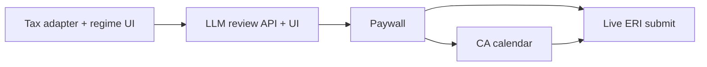

# Phase 2+ backlog — previously out of scope

Items deferred from the ITR-2/ITR-3 routing LTP plan. **M1–M5 are implemented in code** (see below). Remaining work is hardening, live Razorpay UI widget, and contracted ERI partners.

**Defaults:** Razorpay (INR); ICS download for CA invites; ERI mock → sandbox until a contracted partner; Anthropic via existing `@anthropic-ai/sdk`.

## Shipped (this implementation)

| Milestone | Code |
| --- | --- |
| **M1** | [`web/src/lib/itr/compute/tax-adapter.ts`](../../web/src/lib/itr/compute/tax-adapter.ts), [`RegimeComparePanel.tsx`](../../web/src/components/filing/RegimeComparePanel.tsx) |
| **M2** | [`web/src/lib/ai/review.ts`](../../web/src/lib/ai/review.ts), [`POST /api/filing/review`](../../web/src/app/api/filing/review/route.ts), PostValidatePanel |
| **M3** | [`web/src/lib/billing/entitlements.ts`](../../web/src/lib/billing/entitlements.ts), `/api/pay/checkout`, `/api/pay/mock-complete` |
| **M4** | [`web/src/lib/ca/booking.ts`](../../web/src/lib/ca/booking.ts), `/api/ca/book` + ICS download |
| **M5** | [`POST /api/eri`](../../web/src/app/api/eri/route.ts) consent/upload/status via `getEriProvider()` |

UI entry: filing workspace → validate → **After validate** panel (AI review, pay, CA slots, ERI).

## Follow-ups

- Live Razorpay Checkout.js widget (order API already returns `keyId` when keys set)
- Email the ICS via Nodemailer when `AUTH_EMAIL_SERVER` is set
- Persist ERI consent id onto filing row after upload
- Real Quicko/Suvit after contract
- Tighten `ReturnData`→`TaxInput` mapping as more schedule fields fill in production returns

## Still non-goals

- Holding Income Tax portal passwords
- Treating Sandbox KYC as ERI
- Full CA practice console

**Defaults:** Razorpay (INR); ICS + email for CA invites (Google Calendar later); ERI mock → sandbox until a contracted partner; Anthropic via existing `@anthropic-ai/sdk`.

Related: [`../user-journey-target.md`](../user-journey-target.md) stages 9–14 · [`../prompts/itr-ai-full-form-review.md`](../prompts/itr-ai-full-form-review.md) · [`phase-1.md`](./phase-1.md)

---

## Workstream A — Tax computation engines

**Today**

- [`web/src/lib/itr/compute/tax.ts`](../../web/src/lib/itr/compute/tax.ts) — `computeTax` / `compareRegimes` exist but **do not read `ReturnData`** (adapter promised in file comment, missing).
- [`web/src/lib/itr/compute/setoff.ts`](../../web/src/lib/itr/compute/setoff.ts) — `runSetoff` is test-only.
- Wizard **regime step is a stub** ([`FilingWizard.tsx`](../../web/src/components/filing/FilingWizard.tsx)).
- Validate uses schedule `evaluateCalcs` only.

**Ship**

1. **`ReturnData` → `TaxInput` adapter** (new module beside `tax.ts`).
2. **Pipeline:** setoff → `TaxInput` → `computeTax` / `compareRegimes`.
3. Server helper (or small API) used by the wizard with typed results.
4. **Replace regime stub** with real Old vs New comparison (ledger UI, product tokens).
5. Pass tax + comparison into download / later AI audit payloads.
6. Tests: NRI ITR-2 salary+CG fixture; minimal ITR-3 PGBP; golden vs slab tests.

**Success:** User sees real ₹ delta on regime step; audit/download get real computation.

---

## Workstream B — Call form-review LLM from the app

**Today**

- [`web/src/lib/ai/audit.ts`](../../web/src/lib/ai/audit.ts) — `auditReturn` (Anthropic, redaction, no-key → `available: false`).
- **No** `/api/.../review` route; wizard never calls it.
- Inline system prompt ≠ docs prompt (`warn|flag|block`, `WRONG_FORM`).

**Ship**

1. Align Zod/types with [`../prompts/itr-ai-full-form-review.md`](../prompts/itr-ai-full-form-review.md) (`action`, `code`, `userMessage`, `wrongFormSuspected`, `highestAction`, `blocksFilingRecommendation`).
2. Use the upgraded system prompt (keep redaction; never send raw PAN).
3. **`POST /api/filing/review`** (auth): validate → tax adapter → `auditReturn`.
4. Wizard panel after Validate (+ regime): render warn/flag/block; hard-stop recommend-file on `block`; acknowledge on `flag`.
5. No API key → “Review unavailable”; **do not** block Phase-1 JSON download solely for missing AI.
6. Tests: schema parse, 401, no-key path.

**Depends on:** Workstream A.

**Success:** “Review with AI” returns structured flags, including possible `WRONG_FORM`.

---

## Workstream C — Paywall, CA calendar, live ERI

Target journey stages 12–14. Phase 3 product work.

### C1 — Paywall

**Today:** Design-kit pricing mock only; no payment provider in `web/`.

**Ship**

1. SKUs: e.g. self-serve review+JSON vs CA-assisted (confirm free vs paid JSON in intent).
2. Razorpay Checkout + webhook → entitlement on user/filing.
3. Gate CA path and optionally ERI behind entitlement.
4. DB: entitlements (plan, paid_at, provider_payment_id).

### C2 — CA calendar

**Today:** Docs + `caBrief` in review prompt only.

**Ship**

1. Post-payment booking UI (admin-defined slots first).
2. On confirm: **ICS** + email; paste AI `caBrief` into description.
3. Later: Google Calendar OAuth sync.
4. Filing states: `requested → scheduled → ca_changes_needed → approved` → re-validate → final JSON.

### C3 — Live ERI submit

**Today:** [`web/src/lib/eri/`](../../web/src/lib/eri/) — mock, sandbox adapter, Quicko/Suvit names; unused `consents` table; wizard **downloads JSON only**; no `/api/eri/*`.

**Ship**

1. Consent UX + persist `consents` before upload.
2. `/api/eri/upload` + `/api/eri/status` via `getEriProvider()` (mock/sandbox).
3. Wizard exit: Download JSON | Submit via ERI (gated) | Third-party ERI instructions.
4. Ack/status UI; never store IT portal password.
5. Real Quicko/Suvit after contract — same `EriProvider` interface.

**Depends on:** Paywall if ERI is paid; tax+validate green; AI `block` blocks submit unless CA override.

**Success:** Mock/sandbox round-trip → acknowledgement id; partner is a config swap.

---

## Milestone order

| Milestone | Scope | Outcome |
| --- | --- | --- |
| **M1** | Workstream A | Live regime compare + tax on return |
| **M2** | Workstream B | In-app AI review with warn/flag/block |
| **M3** | C1 Paywall | Paid entitlement recorded |
| **M4** | C2 CA calendar | Booked call + ICS |
| **M5** | C3 ERI API + UI | Mock/sandbox submit; partner later |

When M1–M2 start, add or update intent so “compute tax” and “AI review” are committed outcomes (extend phase-1 or add `phase-2.md`).

## Still non-goals

- Holding Income Tax portal passwords
- Treating Sandbox KYC as ERI
- Full CA practice console in M3–M4 (booking + approve flag is enough)
