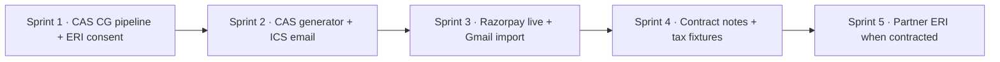

# Phase 3 Execution Plan — Build Hardening + CAS Parser ROI

> **For agentic workers:** REQUIRED SUB-SKILL: Use `superpowers:subagent-driven-development` (recommended) or `superpowers:executing-plans` to implement this plan task-by-task. Steps use checkbox (`- [ ]`) syntax for tracking.

**Goal:** Ship the five Phase-2 follow-ups and fully utilise the purchased CAS Parser Pro API so NRI filers get identity + Schedule CG / 112A from real statements without blocking manual entry.

**Architecture:** Keep the existing soft-fail enrichment pattern. Unify all CAS sources (PDF upload, Portfolio Connect, CDSL OTP, later Gmail) into one apply pipeline that produces `CasParseResult` → `applyCasToReturn`. Monetisation and ERI stay behind entitlements. Mock paths remain when secrets are unset.

**Tech Stack:** Next.js (`web/`), Supabase JS, CAS Parser Pro (`api.casparser.in` + `@cas-parser/connect`), local optional `services/cas` for FIFO, Razorpay Orders + Checkout.js, Nodemailer (`AUTH_EMAIL_SERVER`), Anthropic review (already shipped).

**Related:** [`docs/intent/phase-2-backlog.md`](../../intent/phase-2-backlog.md) · [`docs/intent/phase-1.md`](../../intent/phase-1.md) · [`docs/user-journey-target.md`](../../user-journey-target.md) · [CAS Parser docs](https://casparser.in/docs)

---

## Non-goals (do not build in this plan)

- Holding Income Tax portal passwords
- Treating Sandbox KYC as ERI
- Full CA practice console
- Live Quicko/Suvit until a contract exists (Track E is scaffold-only)
- Auto-filling Schedule FA from Indian demat (FA is foreign assets; NRI rules already clear FA)

---

## Current baseline (do not re-implement)

| Capability | Location |
| --- | --- |
| Tax adapter + regime UI | `web/src/lib/itr/compute/tax-adapter.ts`, `RegimeComparePanel.tsx` |
| AI review | `web/src/lib/ai/review.ts`, `POST /api/filing/review` |
| Paywall order + mock | `web/src/lib/billing/entitlements.ts`, `/api/pay/*` |
| CA book + ICS download | `web/src/lib/ca/booking.ts`, `/api/ca/book` |
| ERI mock/sandbox | `web/src/lib/eri/*`, `/api/eri` |
| CAS Parser client | `web/src/lib/casparser/client.ts` (DigiLocker, PAN KYC, CDSL, smart-parse URL, token) |
| Portfolio Connect UI | `web/src/components/filing/PortfolioImport.tsx` |
| Local FIFO CAS PDF | `services/cas`, `web/src/lib/cas/client.ts`, `/api/cas/parse` |
| Apply into CG | `web/src/lib/cas/apply-cas.ts` |
| Filing column for ERI consent | `filing.eriConsentId` in `web/supabase-schema.sql` |

**Known gap:** `mapSmartParseToCasResult` returns empty gains — Pro smart-parse does not yet fill Schedule CG.

---

## Sprint map (build order)

| Sprint | Outcome | Depends on |
| --- | --- | --- |
| **1** | Pro CAS fills CG; ERI consent id persisted on filing | — |
| **2** | Request Detailed MF CAS; CA ICS emailed when mail configured | Sprint 1 pipeline |
| **3** | Live Razorpay Checkout; Gmail inbox CAS import | Sprint 1; keys for pay |
| **4** | Contract notes → equity CG; tax adapter golden fixtures | Sprint 1 lot path |
| **5** | Real ERI partner adapter | Contract + Sprint 3 paywall |

Work one sprint at a time. Each sprint ends with tests green and a conventional commit on a feature branch.

---

## File map (planned create / modify)

### Create

| File | Responsibility |
| --- | --- |
| `web/src/lib/cas/pipeline.ts` | Single entry: raw/source → `CasParseResult` → apply + warnings |
| `web/src/lib/casparser/map-transactions.ts` | Extract buy/sell txs from smart-parse / holdings into `LotTxn[]` |
| `web/src/lib/casparser/gains-from-lots.ts` | `FifoLotResult` → `CasGainSummary` / `CasGainEntry[]` |
| `web/src/lib/casparser/generate-cas.ts` | Wrapper for `POST /v4/generate` |
| `web/src/lib/casparser/inbox.ts` | Gmail connect / list / disconnect |
| `web/src/lib/casparser/contract-note.ts` | `POST /v4/contract_note/parse` soft-fail client |
| `web/src/app/api/casparser/generate/route.ts` | Auth + generate Detailed CAS |
| `web/src/app/api/casparser/inbox/connect/route.ts` | Start Gmail OAuth |
| `web/src/app/api/casparser/inbox/callback/route.ts` | Store inbox token server-side |
| `web/src/app/api/casparser/inbox/list/route.ts` | List + optional parse/apply |
| `web/src/app/api/pay/webhook/route.ts` | Razorpay signature → entitlement |
| `web/src/app/api/pay/verify/route.ts` | Client-side payment success verify (backup) |
| `web/src/lib/ca/email-invite.ts` | Send ICS via Nodemailer when configured |
| `web/src/lib/eri/partners/quicko.ts` (later) | Partner `EriProvider` |

### Modify

| File | Change |
| --- | --- |
| `web/src/lib/casparser/map-smart-parse.ts` | Fill folios/gains via transactions + lot engine; keep soft warning if none |
| `web/src/lib/casparser/map-portfolio-connect.ts` | Delegate to pipeline / improved mapper |
| `web/src/lib/casparser/client.ts` | Add generate, inbox, contract-note, credits methods |
| `web/src/lib/casparser/types.ts` | Types for new methods |
| `web/src/lib/cas/apply-cas.ts` | Only if pipeline needs new owned fields |
| `web/src/components/filing/EnrichmentPanels.tsx` | Wire generate + Gmail + clearer Detailed CAS CTA |
| `web/src/components/filing/PortfolioImport.tsx` | Call shared pipeline |
| `web/src/components/filing/PostValidatePanel.tsx` | Razorpay Checkout.js; entitlement gates |
| `web/src/lib/billing/entitlements.ts` | Persist Razorpay order notes; verify helper |
| `web/src/lib/ca/booking.ts` | Call email-invite after book |
| `web/src/app/api/eri/route.ts` | Write `filing.eriConsentId` on consent/upload |
| `web/src/lib/itr/compute/tax-adapter.ts` | Map additional schedule keys as fixtures demand |
| `web/.env.example` | Document new env vars |

---

## Sprint 1 — CAS CG pipeline + ERI consent persist

**Success:** Uploading or fetching a Detailed CAS via Pro paths writes non-zero Schedule CG / 112A when transactions exist. ERI consent id survives refresh on the filing row.

### Task 1.1: Failing test — smart-parse with transactions fills gains

**Files:**
- Create: `web/src/lib/casparser/map-smart-parse.test.ts` (or extend existing)
- Fixture: minimal smart-parse JSON with MF scheme transactions (buy + sell in FY)

- [ ] **Step 1:** Add fixture with at least one equity/MF buy and sell with dates spanning STCG/LTCG boundary
- [ ] **Step 2:** Assert `mapSmartParseToCasResult(fixture, '2025-26')` returns `gains.length > 0` and non-zero `summary.longTerm112A` or `shortTerm111A`
- [ ] **Step 3:** Run test — expect **fail** (current mapper returns empty summary)
- [ ] **Step 4:** Commit `test(cas): expect smart-parse transactions to produce CG gains`

### Task 1.2: Map transactions → lot engine → CasGainSummary

**Files:**
- Create: `web/src/lib/casparser/map-transactions.ts`
- Create: `web/src/lib/casparser/gains-from-lots.ts`
- Modify: `web/src/lib/casparser/map-smart-parse.ts`
- Reuse: `web/src/lib/itr/capital-gains/lot-engine.ts`

- [ ] **Step 1:** Extract `LotTxn[]` from `mutual_funds[].schemes[].transactions` and demat equity transactions when present
- [ ] **Step 2:** Run `computeFifoLots` (or existing export) per ISIN
- [ ] **Step 3:** Convert lots → `CasGainEntry` + `CasGainSummary` (quarter from sale date; 111A/112A vs other by asset class heuristic)
- [ ] **Step 4:** If no txs, keep empty summary + existing warning (do not invent gains)
- [ ] **Step 5:** Make Task 1.1 pass
- [ ] **Step 6:** Commit `feat(cas): map smart-parse transactions into Schedule CG gains`

### Task 1.3: Unify apply pipeline

**Files:**
- Create: `web/src/lib/cas/pipeline.ts`
- Create: `web/src/lib/cas/pipeline.test.ts`
- Modify: `web/src/app/api/casparser/cdsl/verify/route.ts`
- Modify: `web/src/components/filing/PortfolioImport.tsx`
- Modify: `web/src/app/api/cas/parse/route.ts` (delegate if clean)

- [ ] **Step 1:** `applyCasPipeline({ data, source, raw | casResult })` → `{ data, fieldsApplied, rowsApplied, warnings }`
- [ ] **Step 2:** Route CDSL verify + Portfolio Connect success through pipeline
- [ ] **Step 3:** Prefer local `services/cas` when PDF upload yields full FIFO result; otherwise Pro mapper
- [ ] **Step 4:** Test: same specimen produces same owned CG keys from both entry points
- [ ] **Step 5:** Commit `refactor(cas): single apply pipeline for all CAS sources`

### Task 1.4: Persist ERI consent id on filing

**Files:**
- Modify: `web/src/app/api/eri/route.ts`
- Modify: filing helpers under `web/src/lib/eri/` or `web/src/lib/filing/`
- Test: extend existing ERI route/mock tests

- [ ] **Step 1:** On consent success and upload success, `update filing set eriConsentId = …` for the active filing
- [ ] **Step 2:** Status handler reads `eriConsentId` from filing when client omits it
- [ ] **Step 3:** Soft-fail if DB write fails — still return upstream ack to user with warning
- [ ] **Step 4:** Test round-trip mock provider stores and reloads id
- [ ] **Step 5:** Commit `feat(eri): persist consent id on filing row`

### Sprint 1 exit checklist

- [ ] `cd web && npm test -- --run casparser cas/pipeline eri` (or project’s vitest filter) green
- [ ] Manual: Portfolio Connect / CDSL / PDF upload still soft-fails without `CASPARSER_API_KEY`
- [ ] Manual: mock ERI consent → refresh → status still works

---

## Sprint 2 — Detailed CAS generator + CA ICS email

**Success:** User can request a Detailed MF CAS to their RTA email. Booking a CA slot emails an ICS when `AUTH_EMAIL_SERVER` is set.

### Task 2.1: CAS Generator API wrapper

**Files:**
- Modify: `web/src/lib/casparser/client.ts`, `types.ts`
- Create: `web/src/app/api/casparser/generate/route.ts`
- Create: `web/src/lib/casparser/client.generate.test.ts`

- [ ] **Step 1:** Add `generateMutualFundCas({ email, fromDate, toDate, password, pan? })` → `POST /v4/generate`
- [ ] **Step 2:** Route: auth required; soft JSON; never block wizard
- [ ] **Step 3:** Default FY window for AY 2026-27: `2025-04-01` … `2026-03-31`
- [ ] **Step 4:** Commit `feat(casparser): request Detailed MF CAS via generator API`

### Task 2.2: Enrichment UI — Request Detailed CAS

**Files:**
- Modify: `web/src/components/filing/EnrichmentPanels.tsx`

- [ ] **Step 1:** CTA: email (prefill from Part A) + password (default PAN) + “Request Detailed CAS”
- [ ] **Step 2:** Copy: statement arrives by email in a few minutes; then upload or use Gmail import (Sprint 3)
- [ ] **Step 3:** Commit `feat(ui): Detailed CAS request in enrichment panel`

### Task 2.3: Email ICS on CA book

**Files:**
- Create: `web/src/lib/ca/email-invite.ts`
- Modify: `web/src/lib/ca/booking.ts`
- Test: `web/src/lib/ca/email-invite.test.ts` (mock transport)

- [ ] **Step 1:** If `AUTH_EMAIL_SERVER` unset → no-op, download path unchanged
- [ ] **Step 2:** If set → send multipart email with `text/calendar` ICS + `caBrief` in body
- [ ] **Step 3:** Soft-fail send errors; booking still succeeds
- [ ] **Step 4:** Commit `feat(ca): email ICS invite when AUTH_EMAIL_SERVER is set`

### Sprint 2 exit checklist

- [ ] Generate route returns clear message without API key
- [ ] With key (staging): request accepted; user receives CAS email from RTA
- [ ] Book CA with mail configured → invite in inbox; without mail → ICS download only

---

## Sprint 3 — Live Razorpay + Gmail inbox import

**Success:** Paid users complete Checkout.js and get entitlements. Users can OAuth Gmail and apply CAS files from inbox via the Sprint 1 pipeline.

### Task 3.1: Razorpay webhook + verify

**Files:**
- Create: `web/src/app/api/pay/webhook/route.ts`
- Create: `web/src/app/api/pay/verify/route.ts`
- Modify: `web/src/lib/billing/entitlements.ts`
- Env: `RAZORPAY_KEY_ID`, `RAZORPAY_KEY_SECRET`, `RAZORPAY_WEBHOOK_SECRET`

- [ ] **Step 1:** Verify webhook signature; on `payment.captured` call `grantEntitlement`
- [ ] **Step 2:** Client verify endpoint: confirm payment id against Razorpay API, then grant (idempotent)
- [ ] **Step 3:** Keep `/api/pay/mock-complete` when `keyId` absent
- [ ] **Step 4:** Tests with fixture signatures / mocked fetch
- [ ] **Step 5:** Commit `feat(pay): Razorpay webhook and payment verify`

### Task 3.2: Checkout.js in PostValidatePanel

**Files:**
- Modify: `web/src/components/filing/PostValidatePanel.tsx`

- [ ] **Step 1:** When checkout `mode === 'razorpay'`, load Checkout.js and open modal with `order_id` + `key`
- [ ] **Step 2:** On success → `/api/pay/verify` → refresh entitlement UI
- [ ] **Step 3:** Gate CA book + ERI submit on `hasCaAccess` / active entitlement (match product rules already in entitlements)
- [ ] **Step 4:** Commit `feat(pay): live Razorpay Checkout.js widget`

### Task 3.3: Gmail inbox connect + list + apply

**Files:**
- Modify: `web/src/lib/casparser/client.ts`
- Create: `web/src/app/api/casparser/inbox/connect/route.ts`
- Create: `web/src/app/api/casparser/inbox/callback/route.ts`
- Create: `web/src/app/api/casparser/inbox/list/route.ts`
- Modify: `EnrichmentPanels.tsx`
- Docs: [Gmail Inbox Import](https://casparser.in/docs/guides/gmail-inbox)

- [ ] **Step 1:** `POST /v4/inbox/connect` with redirect to callback
- [ ] **Step 2:** Store `inbox_token` server-side keyed by user (Supabase table or encrypted column — prefer new `cas_inbox_token` table; never expose long-lived token to client)
- [ ] **Step 3:** List files → smart-parse URL with PAN password → `applyCasPipeline`
- [ ] **Step 4:** Disconnect / revoke endpoint
- [ ] **Step 5:** Soft-fail entire path; manual upload remains
- [ ] **Step 6:** Commit `feat(casparser): Gmail inbox CAS import`

### Sprint 3 exit checklist

- [ ] Mock checkout still works without Razorpay keys
- [ ] Staging Razorpay payment grants entitlement once (no double grant)
- [ ] Gmail path optional; wizard usable without Google

---

## Sprint 4 — Contract notes + tax adapter fixtures

**Success:** Broker contract notes contribute equity CG without double-counting CAS sales. Tax adapter has golden fixtures for core NRI shapes.

### Task 4.1: Contract note parse + map

**Files:**
- Create: `web/src/lib/casparser/contract-note.ts`
- Create: `web/src/app/api/casparser/contract-note/route.ts`
- Modify: client + EnrichmentPanels
- Docs: [Contract notes](https://casparser.in/docs/guides/contract-notes)

- [ ] **Step 1:** Soft-fail parse multipart PDF → equity transactions
- [ ] **Step 2:** Map into `LotTxn[]` → gains → merge into return via pipeline (additive with warning if CAS already applied)
- [ ] **Step 3:** Dedupe heuristic: same ISIN + sale date + qty → skip + warn
- [ ] **Step 4:** Commit `feat(casparser): contract note import for equity CG`

### Task 4.2: Tax adapter golden fixtures

**Files:**
- Modify: `web/src/lib/itr/compute/tax-adapter.ts` as needed
- Extend: `web/src/lib/itr/samples/golden-fixtures.ts` / `*.test.ts`
- Samples: `nri-priya-itr2`, minimal ITR-3 PGBP

- [ ] **Step 1:** Lock expected old/new tax for NRI salary+CG fixture
- [ ] **Step 2:** Add ITR-3 minimal PGBP fixture expectations
- [ ] **Step 3:** Map any missing `ReturnData` keys that fixtures expose
- [ ] **Step 4:** Commit `test(tax): golden fixtures for NRI ITR-2 and minimal ITR-3`

### Sprint 4 exit checklist

- [ ] Contract note without API key → soft message
- [ ] Golden tax tests green in CI

---

## Sprint 5 — Live ERI partner (blocked on contract)

**Success:** Config swap from mock/sandbox to Quicko or Suvit without wizard rewrite.

### Task 5.1: Partner provider behind `getEriProvider()`

**Files:**
- Create: `web/src/lib/eri/partners/<partner>.ts`
- Modify: `web/src/lib/eri/index.ts` (or existing factory)
- Env: partner base URL + API keys

- [ ] **Step 1:** Implement same consent / upload / status interface as mock
- [ ] **Step 2:** Never store portal password
- [ ] **Step 3:** E2E staging: consent → upload → acknowledgement id in UI
- [ ] **Step 4:** Commit `feat(eri): <partner> provider adapter`

Do **not** start Sprint 5 until credentials exist.

---

## Environment variables (document in `.env.example`)

| Variable | Sprint | Purpose |
| --- | --- | --- |
| `CASPARSER_API_KEY` | 1+ | Pro API |
| `CASPARSER_BASE_URL` | optional | Override API host |
| `CAS_SERVICE_URL` / `CAS_SERVICE_TOKEN` | 1 | Local FIFO PDF service |
| `AUTH_EMAIL_SERVER` / `AUTH_EMAIL_FROM` | 2 | ICS email |
| `RAZORPAY_KEY_ID` / `RAZORPAY_KEY_SECRET` | 3 | Checkout |
| `RAZORPAY_WEBHOOK_SECRET` | 3 | Webhook verify |
| Partner ERI keys | 5 | After contract |

---

## CAS credit efficiency rules (always)

1. Prefer **Detailed** MF CAS for tax; Summary/holdings-only → identity + warning, not fake CG.
2. Cache last successful parse payload per filing (reuse on re-apply; do not re-parse same PDF).
3. One pipeline for all sources.
4. Soft-fail: missing key / quota / timeout → manual entry stays open.
5. Generator + Gmail is the default NRI path; CDSL OTP is power-user.

---

## How to execute this plan

1. Create branch: `feat/phase3-sprint-1-cas-pipeline` (never commit to `main`).
2. Implement **Sprint 1** only until exit checklist passes.
3. Open PR; merge; then branch for Sprint 2.
4. Agents: run tasks in order; one failing test → minimal implementation → commit per task.
5. After each sprint, update the “Follow-ups” section in `docs/intent/phase-2-backlog.md` to mark items done.

---

## Definition of done (whole Phase 3)

- [ ] Sprint 1–4 exit checklists complete
- [ ] Phase-2 follow-ups 1–4 closed (Razorpay UI, ICS email, ERI consent persist, tax fixtures)
- [ ] CAS Pro: smart-parse/CDSL/Portfolio Connect/Gmail/generator/contract notes all soft-fail and feed CG when data exists
- [ ] Sprint 5 only after partner contract
- [ ] No new hard dependency that blocks fill → validate → download JSON
