# NRITAX 2.0 — Target user journey

Product vision flow (beyond Phase 1). Phase 1 ships the fill → validate → download JSON spine; this document is the intended end-to-end journey.

```mermaid
flowchart TD
  A([Login]) --> B[Select filing / assessment year]
  B --> C[Choose screen]
  C --> C1{ITR-2 · ITR-3 · I'm not sure}
  C1 -->|ITR-2 or ITR-3| K[Killer confirmation]
  C1 -->|I'm not sure| Q[Clarifying question set]
  K -->|Pass| D{Track}
  K -->|Fail / not sure| Q
  Q --> D
  D -->|ITR-2| E1[Start ITR-2 track]
  D -->|ITR-3| E2[Start ITR-3 track]

  E1 --> F[Capture Name · PAN · Mobile]
  E2 --> F

  F --> G[Download / fetch pre-filled JSON<br/>from Income Tax website]
  G --> H[Store prefill JSON securely]
  H --> I[Map prefill into vertical fields<br/>of ITR-2 / ITR-3]

  I --> J[Auto-enrich remaining fields]
  J --> J1[CAS · mutual funds]
  J --> J2[DigiLocker]
  J --> J3[Email scanning]
  J1 --> DocStep
  J2 --> DocStep
  J3 --> DocStep

  DocStep[Document upload for gaps]
  DocStep --> K1[e.g. Form 16 · 26AS · AIS · proofs]
  K1 --> K2[AI extract → map to fields]

  K2 --> L[Manual confirmation wizard]
  L --> L1[Ask only for what is still missing<br/>or needs human confirmation]

  L1 --> M[Old vs New regime comparison]
  M --> N[Validate as per Income Tax guidelines]

  N --> O[AI full-form review]
  O --> O1[warn / flag / block]
  O --> O2[wrong_form_suspected if needed]
  O1 --> P
  O2 --> P

  P{User wants CA intervention?}
  P -->|No| PaySelf[Paywall · self-serve path]
  P -->|Yes| R[Paywall · CA-assisted path]

  R --> S[Schedule CA call<br/>+ calendar invite]
  S --> T{CA approves?}
  T -->|Changes needed| L1
  T -->|Approved| U[Re-validate]

  PaySelf --> U
  U --> V[Generate final filing JSON]
  V --> W{How to submit?}

  W -->|Own / partner ERI| X[File via ERI]
  W -->|Third-party ERI| Y[Hand off to third-party ERI]
  W -->|Manual| Z[Instructions + JSON download<br/>→ portal upload]

  X --> AA([Acknowledgement · e-verify])
  Y --> AA
  Z --> AA
```

## Stages (short)

| # | Stage | What happens |
| --- | --- | --- |
| 1 | Login | Authenticate (email / Google / etc.) |
| 2 | Filing year | Pick AY / FY |
| 3 | Form decision | **ITR-2 · ITR-3 · I’m not sure**; direct pick → killer confirmation; unsure/fail → clarifying quiz (see [`itr-form-selection.md`](./itr-form-selection.md)) |
| 4 | Identity | Name, PAN, mobile |
| 5 | Prefill | Fetch/download ITD JSON → store → map into form |
| 6 | Auto-enrich | CAS, DigiLocker, email scan attempt leftover fields |
| 7 | Document AI | User uploads Form 16 etc. → AI fills mapped fields |
| 8 | Manual wizard | Confirm gaps only — no full re-entry |
| 9 | Regime | Clear Old vs New comparison |
| 10 | Validate | Statutory / schema validation |
| 11 | AI review | Tweaks + discrepancies with **warn / flag / block**; may emit `wrong_form_suspected` ([prompt](./prompts/itr-ai-full-form-review.md)) |
| 12 | CA optional | Paywall → calendar invite → CA approve |
| 13 | Final JSON | Re-validate → generate JSON |
| 14 | Submit | ERI / third-party ERI / manual portal upload |

## Related

- Form selection rules: [`itr-form-selection.md`](./itr-form-selection.md)
- Current shipped spine: [`user-journey-phase-1.md`](./user-journey-phase-1.md)
- AI form review prompt: [`prompts/itr-ai-full-form-review.md`](./prompts/itr-ai-full-form-review.md)
- LTP record: [`thinking/2026-07-28-itr-form-selection.md`](./thinking/2026-07-28-itr-form-selection.md)
